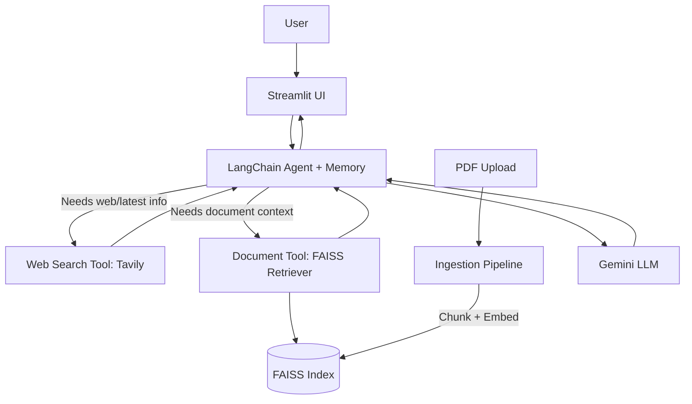

# AI Research Assistant

## Project Overview

This project is a Gemini-powered AI assistant that combines:

- Conversation memory
- Document Q&A using RAG with FAISS
- Real-time web search using Tavily
- A Streamlit chat interface

It is organized as a modular Python codebase so each concern (UI, agent logic, tools, RAG pipeline, config, logging) is isolated and easier to debug.

## One-Line Summary

Multi-tool Gemini agent that routes questions between direct LLM reasoning, document retrieval, and web search while preserving chat context.

## Architecture



## End-to-End Runtime Flow

1. `app.py` boots logging and loads the Streamlit page renderer.
2. `ui/chat_page.py` loads server-side secrets (Streamlit Secrets first, `.env` fallback), shows PDF upload controls, and stores chat/session state.
3. The UI renders a runtime health strip (Gemini config, model, web search, document index, agent readiness).
4. The app auto-initializes the agent from server-side settings.
5. When user asks a question, the app sends it to `agent/agent.py`.
6. Agent turn execution applies lightweight retries for transient failures.
7. The agent applies a light routing hint:
   - web-like query -> prefer `web_search`
   - doc-like query -> prefer `document_search`
8. If PDF has been processed, retriever is available from `rag/retriever.py`.
9. Agent returns final answer to Streamlit chat history.

## Project Structure (Detailed)

```text
ai agent project/
  app.py
  chat_cli.py
  gemini_test.py
  requirements.txt
  environment.yml
  README.md
  .env.example
  .gitignore

  agent/
    __init__.py
    agent.py
    memory.py
    tools.py

  rag/
    __init__.py
    ingest.py
    retriever.py

  ui/
    __init__.py
    chat_page.py

  core/
    __init__.py
    config.py
    logger.py

  data/
    .gitkeep
    faiss_index/      # created at runtime after PDF ingestion

  .venv/             # local conda env (recommended in this repo)
  .conda/            # optional/older local env folder if present
```

### File-by-File Explanation

#### Top-Level Files

- `app.py`
  - Main application entrypoint.
  - Calls `setup_logging()` and `render_app()`.

- `chat_cli.py`
  - Command-line chat loop for quick Gemini checks.
  - Loads `.env` and validates `GEMINI_API_KEY` before sending prompts.

- `gemini_test.py`
  - Minimal Gemini connectivity test script.
  - Loads `.env` and calls a single prompt (`What is an AI agent?`).

- `requirements.txt`
  - Python dependencies for app + agent + RAG + UI.

- `environment.yml`
  - Conda environment spec pinned to Python 3.10 and pip requirements.

- `.env.example`
  - Template for environment variables (placeholders only).

- `.gitignore`
  - Ignores secrets, local envs, IDE files, and generated artifacts.

#### `core/` (Shared Infrastructure)

- `core/config.py`
  - Defines `Settings` dataclass.
  - `get_settings()` reads runtime settings from Streamlit Secrets first, then environment variables.
  - Uses safe integer parsing for `RAG_TOP_K` with default/bounds fallback.

- `core/logger.py`
  - One-time logging bootstrap for consistent log format across modules.

#### `agent/` (Agent Runtime)

- `agent/agent.py`
  - Builds the LangChain conversational ReAct agent.
  - Uses `langchain_classic.agents` compatibility imports.
  - Wires tools, memory, model, and system guidance.
  - Implements routing hints in `route_user_query()`.
  - Executes turns with `run_agent_turn()` using error classification and transient retry logic.

- `agent/memory.py`
  - Builds `ConversationBufferMemory` for chat history continuity.

- `agent/tools.py`
  - `web_search_tool`: Tavily-powered web lookup.
  - `make_document_tool`: wraps FAISS retriever as `document_search` tool.

#### `rag/` (Document Pipeline)

- `rag/ingest.py`
  - Loads PDF (`PyPDFLoader`).
  - Chunks text (`RecursiveCharacterTextSplitter`).
  - Embeds chunks (`GoogleGenerativeAIEmbeddings`).
  - Writes FAISS index to disk.

- `rag/retriever.py`
  - Loads persisted FAISS index.
  - Creates retriever with configurable top-k.

#### `ui/` (Presentation Layer)

- `ui/chat_page.py`
  - Streamlit layout and sidebar controls.
  - Uses server-side secrets and exposes only PDF upload/index controls in the sidebar.
  - Shows runtime health indicators and startup/runtime notices.
  - Stores chat messages and tool state in `st.session_state`.

#### `data/` (Artifacts)

- `data/.gitkeep`
  - Keeps empty data directory in version control.
- `data/faiss_index/`
  - Runtime-generated FAISS files after processing PDFs.

## Features

1. Gemini chat for general questions.
2. Conversational memory across turns.
3. PDF ingestion and semantic retrieval.
4. Real-time web search via Tavily.
5. Lightweight query routing hints.
6. Streamlit UI with upload + chat.
7. Runtime health panel for fast diagnostics.
8. Logging and explicit fallback messages on failures.
9. Transient retry handling on agent turn failures.

## Setup (Linux + Anaconda Recommended)

### 1. Create local conda env in project folder

```bash
conda create -y -p "$PWD/.venv" python=3.10
conda activate "$PWD/.venv"
```

Alternative using environment file:

```bash
conda env create -p "$PWD/.venv" -f environment.yml
conda activate "$PWD/.venv"
```

### 2. Install dependencies

```bash
pip install -r requirements.txt
```

### 3. Create and configure `.env` (local development)

```bash
cp .env.example .env
chmod 600 .env
```

Edit `.env` and set real values (not placeholders).

## Secure Streamlit Deployment

For Streamlit Community Cloud or hosted Streamlit:

1. Keep secrets out of the repository.
2. Use `streamlit_secrets.example.toml` as a template.
3. In Streamlit app settings, add secrets (server-side):

```toml
GEMINI_API_KEY = "YOUR_GEMINI_API_KEY"
TAVILY_API_KEY = "YOUR_TAVILY_API_KEY"
GEMINI_MODEL = "gemini-2.0-flash"
FAISS_INDEX_DIR = "/tmp/faiss_index"
RAG_TOP_K = 4
```

4. Do not expose key inputs in the UI (this app already hides them).
5. Rotate keys immediately if they were ever pasted in screenshots/chat logs.

## Environment Variables (Detailed)

| Variable | Required | Example | Used by | Description |
|---|---|---|---|---|
| `GEMINI_API_KEY` | Yes | `AIza...` | Agent, UI, RAG | Primary API key for Gemini chat + embeddings |
| `TAVILY_API_KEY` | Optional | `tvly-...` | Web search tool | Enables live web search |
| `GEMINI_MODEL` | Optional | `gemini-2.0-flash` | UI/agent build | Default chat model |
| `FAISS_INDEX_DIR` | Optional | `data/faiss_index` | RAG ingest/retriever | Directory for vector index files |
| `RAG_TOP_K` | Optional | `4` | Retriever | Number of chunks returned per doc query |

Important:

- In deployment, use Streamlit Secrets (server-side) for real keys.
- For local development, `.env` is supported.
- Keep `.env.example` as placeholder values only.
- `.env` is ignored by git.

## Running the Project

### Streamlit App (main mode)

```bash
conda activate "$PWD/.venv"
streamlit run app.py
```

### CLI chat mode

```bash
conda activate "$PWD/.venv"
python chat_cli.py
```

### Gemini connectivity test

```bash
conda activate "$PWD/.venv"
python gemini_test.py
```

## How to Use the App (Step-by-Step)

1. Launch Streamlit app.
2. Ensure server-side secrets are configured (`GEMINI_API_KEY`, optional `TAVILY_API_KEY`).
3. Ask general questions in chat.
4. For document mode:
   - Upload PDF
   - Click **Process PDF**
   - Ask questions about document content

## RAG Pipeline Details

1. PDF upload is saved to a temporary file.
2. `ingest_pdf()` loads pages with `PyPDFLoader`.
3. Text is chunked (size 1000, overlap 150 by default).
4. Chunks are embedded with Gemini embeddings (`models/embedding-001`).
5. FAISS index is saved to `FAISS_INDEX_DIR`.
6. `load_retriever()` returns a retriever (`k=RAG_TOP_K`).
7. Agent uses `document_search` tool to fetch context blocks for answers.

## Validation Commands

Run a quick import smoke test from local env:

```bash
conda run -p "$PWD/.venv" python -c "import app, chat_cli, gemini_test, core.config, agent.agent, agent.memory, agent.tools, rag.ingest, rag.retriever, ui.chat_page; print('FINAL_IMPORTS_OK')"
```

## Troubleshooting

### "GEMINI_API_KEY is required" or empty responses

- Ensure server-side secrets contain a real key (or `.env` for local).
- Restart Streamlit after changing secrets/configuration.

### Web search not working

- Confirm `TAVILY_API_KEY` is set.
- Without it, the tool intentionally returns a clear fallback message.

### Document tool says no index loaded

- Upload PDF and click **Process PDF** first.
- Check `data/faiss_index` exists after processing.

### Import error around LangChain agent APIs

- This codebase uses compatibility imports from `langchain_classic` in `agent/agent.py` and `agent/memory.py`.
- Keep dependency set from `requirements.txt` to avoid mismatch.

### 404 model not found or 429 quota errors

- If you see 404 NOT_FOUND for a model, set `GEMINI_MODEL` in secrets/config to a supported model such as `gemini-2.0-flash`.
- If you see 429 RESOURCE_EXHAUSTED, your key/project quota is exhausted.
- For 429, check quota and billing, wait for reset, or use another API key/project.

## Security Notes

- Never commit real API keys.
- Keep `.env` file permissions restricted (`chmod 600 .env`).
- Rotate keys if accidentally exposed.

## Compatibility Notes

- `gemini_test.py` uses the supported `google.genai` SDK.
- Python 3.10 works for this project now, but some Google libraries warn about future support timelines.

## 11-Step Plan Coverage

1. Environment + Gemini integration: complete.
2. Basic chat system: complete.
3. Conversation memory: complete.
4. RAG from PDFs: complete.
5. RAG quality improvements: complete.
6. Web search capability: complete.
7. Agent tool decision-making: complete.
8. Smart routing logic: complete.
9. Streamlit UI integration: complete.
10. Cleanup and error handling: complete.
11. Documentation and run guide: complete.

## Resume Bullet

Built a Gemini-powered multi-tool AI agent with conversational memory, RAG-based PDF retrieval, and real-time web search using LangChain, FAISS, Tavily, and Streamlit.
